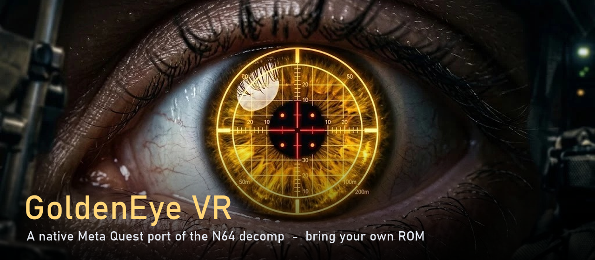

<p align="center">
  
</p>

<h1 align="center">GoldenEye VR</h1>

<p align="center">
  <b>GoldenEye 007, running natively on your Meta Quest.</b><br>
  No PC, no streaming, no emulator: a from-source port built on the GoldenEye decompilation.
</p>

<p align="center">
  <a href="https://github.com/MrSco/goldeneye-vr/releases/latest"></a>
  <a href="https://github.com/MrSco/goldeneye-vr/releases"></a>
  
  <a href="LICENSE"></a>
</p>

<p align="center">
  <a href="#-install-it-in-5-steps">Install</a> ·
  <a href="#-controls">Controls</a> ·
  <a href="#-troubleshooting">Troubleshooting</a> ·
  <a href="#-building-from-source">Build</a> ·
  <a href="#-credits">Credits</a>
</p>

---

> [!IMPORTANT]
> **Bring your own game.** This download contains **no** GoldenEye 007 game data:
> no ROM, graphics, sound, music, text or levels. You need a ROM of the
> **USA (NTSC-U)** cartridge that you own. The app reads everything it needs from that
> file on your headset. Please don't ask for ROMs, and don't share them in Issues.

## ✨ What you get

**Two ways to play. Pick one at launch, and switch any time in game.**

| 🥽 Stereo VR | 📺 Big virtual screen |
|---|---|
| Real 3D first-person play. Look around with your head, lean and step with your body. | The whole game on a cinema-sized screen floating in front of you. |
| Aim the gun with your **right hand**. Shots leave the muzzle and go where the barrel points. | **Flat or curved** screen, any size and distance. |
| A 3D sight where your shot will land. Your ammo counter sits on the gun. | **Grab the screen** with both grips to move it anywhere. |
| Your **left arm** is there too. Raise your wrist and look at it to open **Bond's watch**. | The classic experience, with no motion at all. |
| Smooth or snap turning, and an optional **comfort vignette** for motion sickness. | |

Also:
- An **in-VR launcher**: ROM check, display mode, screen shape and size, turning and comfort.
- **Laser-pointer menus**: point a controller at the file and mission folders and pull the trigger.
- Menus, briefings and cutscenes play on the virtual screen in both modes.

## 🚀 Install it in 5 steps

First time sideloading? No problem. You'll need:
- your Quest
- a USB-C cable (the charging cable works)
- a Windows PC or Mac
- your GoldenEye 007 (USA) ROM file: `.z64`, `.v64` or `.n64`, 12 MB

### 1. Turn on Developer Mode (one time only)

Meta only lets you install apps from outside the Store once Developer Mode is on.

1. Go to **[developers.meta.com/horizon](https://developers.meta.com/horizon/)** and sign in
   with the same Meta account your headset uses.
2. Create an **organization**. It's free: any name works, then accept the agreement. If
   Meta asks you to verify your account, do that as well.
3. On your phone, open the **Meta Horizon** app.
4. Go to **Devices**, pick your headset, then **Headset settings** → **Developer mode**, and turn it **on**.
5. **Restart** the headset.

### 2. Install SideQuest on your computer

SideQuest is the most popular free tool for installing apps on a Quest.
Download the **Advanced Installer** from **[sidequestvr.com/setup-howto](https://sidequestvr.com/setup-howto)**
and install it like any other program.

### 3. Connect your Quest

1. Plug the headset into your computer with the USB cable.
2. **Put the headset on.** A window asks **"Allow USB debugging?"**. Tick
   **"Always allow from this computer"** and press **Allow**.
3. In SideQuest, the dot at the top-left turns **green** and shows your headset's name.

> If it stays red or orange, unplug and replug the cable, and look inside the headset for the prompt again.

### 4. Install GoldenEye VR

1. Download **`GoldenEye-VR-vX.Y.Z.apk`** from the **[latest release](https://github.com/MrSco/goldeneye-vr/releases/latest)**.
2. In SideQuest, click the **"Install APK file from folder on computer"** icon (a box with an arrow,
   top right), choose the APK, and wait for **"All tasks completed"**.
   Dragging the APK onto the SideQuest window works too.

### 5. Add your ROM, then play

1. In the headset, open **Library**, change the filter to **Unknown Sources**, and start **GoldenEye VR**.
   The launcher opens and shows **"No GoldenEye ROM yet"**. That's expected; this first start
   creates the app's folder.
2. With the headset still plugged in, copy your ROM into this folder:

   ```text
   Android/data/com.gevr.port/files/data
   ```

   - **Windows:** open File Explorer and go to **This PC** → **Quest** → **Internal shared storage** →
     **Android** → **data** → **com.gevr.port** → **files** → **data**, then drop the ROM in.
     If the Quest shows up empty, put the headset on and accept **"Allow access to data"**.
   - **Mac, or any computer:** in SideQuest, click the **folder** icon (Manage files on the headset),
     browse to that folder, and upload the ROM.

   Any file name works: the launcher recognizes the ROM and renames it for you.
   Or skip the cable: press **Choose ROM file...** in the launcher and pick the ROM
   from the headset's storage (for example the **Download** folder).
3. Back in the headset, press **Look again**. The ROM line turns green, and it says
   **GoldenEye 007 (USA) - OK**.
4. Pick your options and press **START**. Enjoy, 007. 🍸

> [!TIP]
> Comfortable with the command line? You can skip SideQuest:
> ```bash
> adb install GoldenEye-VR-vX.Y.Z.apk
> ```
> Start the app once so it creates its folder (a folder made by `adb` belongs to the
> USB shell, and the app then can't save its settings), then push the ROM:
> ```bash
> adb push "GoldenEye 007 (USA).z64" /sdcard/Android/data/com.gevr.port/files/data/ge.z64
> ```

### Updating

Install the new APK the same way. Your ROM and settings stay where they are.
**Don't uninstall first:** uninstalling deletes the app's folder, ROM included.

## 🎮 Controls

### Stereo VR

| Control | Action |
|---|---|
| **Right trigger** | Fire (the gun in your right hand) |
| **Left trigger** | Aim / zoom, or fire the left gun when dual-wielding |
| **Right grip** | Aim / zoom, and shows the 3D sight |
| **Left stick** | Walk and strafe |
| **Right stick** | Turn: smooth or snap, set in the launcher |
| **Left stick click** | Crouch (toggle) |
| **A** / **Y** | Next weapon |
| **B** / **X** | Action: doors, switches, reload |
| **☰ Menu** (left controller) | Pause / Bond's watch |
| **Raise left wrist to your face** | Open Bond's watch |
| **Both stick clicks** | Recenter the view |
| **Hold right stick click** (1 s) | Switch to the virtual screen |

Real-world movement works too: lean around corners, duck, and step.

### Virtual screen (flat play, menus and cutscenes)

| Control | Action |
|---|---|
| **Either trigger** | Fire (in menus: select) |
| **Grips** | Aim / zoom |
| **Left stick** | Walk and strafe (in menus: move the cursor) |
| **Right stick** | Look and turn (in menus: move the cursor) |
| **Point a controller** | Laser pointer for the file and mission folders |
| **Hold both grips and move your hands** | Carry the screen somewhere else |
| **Hold both grips and use the right stick** | Up/down: nearer/farther. Left/right: smaller/bigger |
| **Hold left stick click** (1 s) | Bring the screen back in front of you |
| **Hold right stick click** (1 s) | Switch to stereo VR |
| **Grips** (in Bond's watch) | Turn the watch pages |

## ⚙️ Settings

Everything in the launcher is saved for next time. Finer settings live in
`Android/data/com.gevr.port/files/data/goldeneye-vr.ini`, which explains each line: gun
position in your hand, HUD distance, player height and more. Edit it on your
computer while the headset is plugged in.

The launcher's first line shows the build, for example `Build 4526b62 built 2026-09-23 15:10`.
Mention it when you report a bug.

## 🛟 Troubleshooting

<details>
<summary><b>I can't find the app in my Library</b></summary>

Change the Library filter (top of the Library window) from **All** to **Unknown Sources**.
</details>

<details>
<summary><b>"No GoldenEye ROM yet" after I copied it</b></summary>

- It must be in `Android/data/com.gevr.port/files/data`, the `data` folder *inside* `files`.
- Press **Look again**, or restart the app.
- The ROM must be the **USA** cartridge and exactly **12 MB** (12,582,912 bytes).
  European (PAL) and Japanese versions aren't supported yet. The launcher says what's wrong
  with a file it found.
</details>

<details>
<summary><b>The Quest shows no files in Windows Explorer</b></summary>

Put the headset on and accept **Allow access to data**, then reopen the Quest in File Explorer.
Or use SideQuest's file manager instead.
</details>

<details>
<summary><b>SideQuest says the device is unauthorized, or the dot is red</b></summary>

Developer Mode must be on (step 1). Put the headset on while it's plugged in and accept
**Allow USB debugging**. Try another cable or port if it still won't connect: some cables only charge.
</details>

<details>
<summary><b>The install fails with a "signatures do not match" error</b></summary>

You have a build signed by someone else installed (for example one you built yourself).
Back up your ROM and `goldeneye-vr.ini` from the app folder, uninstall the old app, install
the release, then copy them back.
</details>

<details>
<summary><b>Moving around makes me queasy</b></summary>

In the launcher, turn on **Comfort** (darkens the edges while you move) and try **Snap** turning.
Or play on the virtual screen, which has no artificial motion at all.
</details>

## 🧭 Status

The whole game boots, and the Dam has been played end to end in both modes. Other levels
are playable but less tested. Expect rough edges: this is an early release.
Found a bug? Open an [Issue](https://github.com/MrSco/goldeneye-vr/issues) with:
- the build line from the launcher
- your headset model
- the level
- what happened

For the engineering side, see [STATUS.md](STATUS.md) and the session log in [HANDOFF.md](HANDOFF.md).

## 🛠 Building from source

<details>
<summary><b>Requirements and steps</b></summary>

| | |
|---|---|
| Host | Windows (the build scripts assume it) |
| Target | Android / Horizon OS, `arm64-v8a` |
| NDK | `25.1.8937393` (Clang) |
| CMake | 3.22.1 |
| Device | Quest 2 / Pro / 3 / 3S with Developer Mode on |

The root `CMakeLists.txt` builds `libgevr.so`, and the Gradle project in `android/` packages it.
The first configure fetches **SDL2** and **zlib** with CMake `FetchContent`, so it needs network
access. The OpenXR loader is vendored under `OpenXR/`.

Point `android/local.properties` at your SDK (Android Studio writes it for you):

```text
sdk.dir=C\:\\Users\\<you>\\AppData\\Local\\Android\\Sdk
```

Then build:

```bash
cd android && ./gradlew.bat assembleDebug
```

The APK lands in `android/app/build/outputs/apk/debug/`.
`powershell -File tools\gevr_boot_test.ps1` builds, installs, launches and captures a boot log in one go.

> Clone to a short path on Windows. The NDK nests object files deeply, and a long path
> ends in `ninja: error: manifest 'build.ninja' still dirty after 100 tries`.

**About `assets/`:** the repository keeps only the decompilation's tables the code
compiles against: file and image indexes, model headers, weapon stats, render-state
lists. None of Rare's content is here. Animations, textures, models, levels, text,
fonts, music and the Rareware logo are all read from the player's ROM at runtime.
Some developer tools under `tools/` expect the full `assets/` tree of
[n64decomp/007](https://github.com/n64decomp/007) next to a ROM you own.
</details>

<details>
<summary><b>Where things live</b></summary>

| Path | What |
|------|------|
| `src/` | GoldenEye engine and game code from the decomp |
| `port/src/`, `port/include/` | Host layer: platform, ROM loading, soft audio mixer |
| `port/fast3d/` | N64 display lists to OpenGL ES |
| `port/vr/` | OpenXR session, stereo, controllers, the in-VR launcher |
| `assets/` | Decompiled tables the code compiles against (no game content) |
| `android/` | Gradle project and `MainActivity` |
| `tools/` | Build, probe and generator scripts |
| `docs/` | Deep dives on specific subsystems |
</details>

## 🙏 Credits

Built on the shoulders of:
- **[n64decomp/007](https://github.com/n64decomp/007)**: the GoldenEye decompilation, our `src/`.
- **[Perfect Dark PC port](https://github.com/fgsfdsfgs/perfect_dark)**: our host layer.
- **[Perfect Dark VR](https://github.com/Alex-LeTux/perfect_dark_VR)** by Alex-LeTux: our VR layer.
- **[GoldenEye PC port](https://github.com/jkdansereau/goldeneye-pc-port)**: 64-bit porting findings.
- **[GEVR](https://github.com/no6969el/GEVR)**: the PC VR project that inspired this one.

[CREDITS.md](CREDITS.md) says exactly what each project contributed.

This project's own code is **MIT** licensed ([LICENSE](LICENSE)). Vendored components keep their own notices:

| Path | Upstream | Notice |
|------|----------|--------|
| `port/` | Perfect Dark PC port | [`port/LICENSE`](port/LICENSE) |
| `port/vr/` | perfect_dark_VR | [`port/vr/LICENSE`](port/vr/LICENSE) |
| `src/` | n64decomp/007 | upstream ships no licence file |
| `port/vr/imgui/` | Dear ImGui | `port/vr/imgui/LICENSE.txt` |
| `port/fast3d/` | n64-fast3d-engine | `port/fast3d/LICENSE.txt` |
| `OpenXR/` | Khronos OpenXR loader | Apache-2.0 |

The app icon and banner art were made for this project.

---

<sub>GoldenEye VR is a non-commercial fan project. It is not affiliated with, endorsed by or
sponsored by Nintendo, Rare, Microsoft, MGM, Danjaq or Eon Productions. GoldenEye 007, James Bond and 007 are
trademarks of their respective owners. No copyrighted game content is distributed with this
project; you must supply a ROM of a cartridge you own.</sub>
