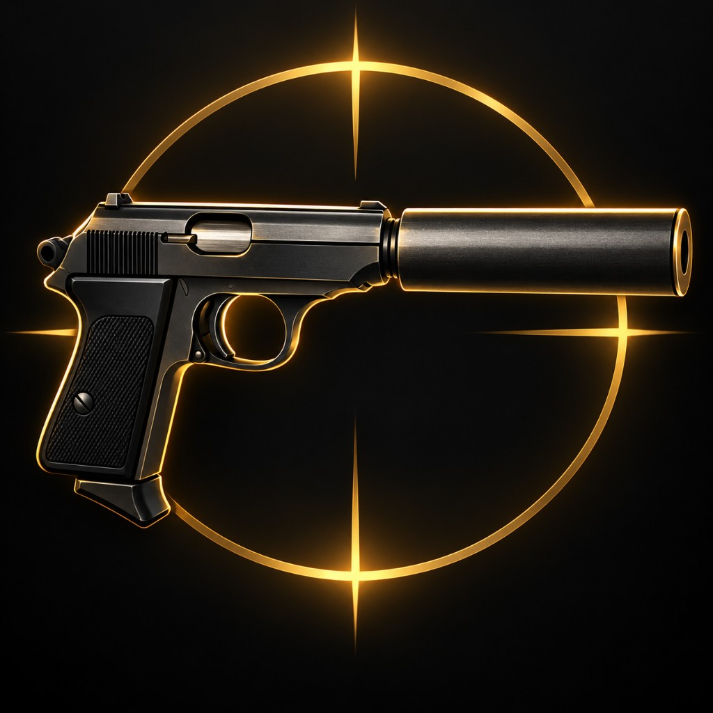

<p align="center">
  
</p>

<p align="center">
  
</p>

<h1 align="center">GoldenEye VR</h1>

<p align="center">
  <b>GoldenEye 007, running natively on your Meta Quest.</b><br>
  No PC, no streaming, no emulator: a from-source port built on the GoldenEye decompilation.
</p>

<p align="center">
  <a href="https://goldeneyevr.com"></a>
  <a href="https://github.com/MrSco/goldeneye-vr/releases/latest"></a>
  <a href="https://github.com/MrSco/goldeneye-vr/releases"></a>
  
  <a href="LICENSE"></a>
</p>

<p align="center">
  <a href="#-install-it-in-5-steps">Install</a> ·
  <a href="#-goldeneye-x-optional-wip">GE-X</a> ·
  <a href="#-controls">Controls</a> ·
  <a href="#-troubleshooting">Troubleshooting</a> ·
  <a href="#-building-from-source">Build</a> ·
  <a href="#-credits">Credits</a>
</p>

---

> [!IMPORTANT]
> **Bring your own game.** This download contains **no** GoldenEye 007 game data:
> no ROM, graphics, sound, music, text or levels. You need a ROM of the
> **USA (NTSC-U)** cartridge that you own. The app reads everything it needs from that
> file on your headset. Please don't ask for ROMs, and don't share them in Issues.

> [!NOTE]
> **v0.4.15** adds **Body slots** (weapons holstered on your body, with a wheel
> when you look at a slot), a GoldenEye X hand reload that keeps your magazines,
> and two-handed grips with a gun in either hand. It plays online with v0.4.14;
> v0.4.13 and older can't join. See [the v0.4.15 notes](docs/releases/v0.4.15.md).

## ✨ What you get

**Two ways to play. Pick one at launch, and switch any time in game.**

| 🥽 Stereo VR | 📺 Big virtual screen |
|---|---|
| Real 3D first-person play. Look around with your head, lean and step with your body. | The whole game on a cinema-sized screen floating in front of you. |
| Aim the gun with your **right hand**. Shots leave the muzzle and go where the barrel points. | **Flat or curved** screen, any size and distance. |
| A 3D sight where your shot will land. Your ammo counter sits on the gun. | **Grab the screen** with both grips to move it anywhere. |
| Your **left arm** is Bond's own suit sleeve with his watch, keeping mission time and showing live health, armor, and multiplayer radar. The launcher offers **Off / On / Only** for wrist status and a separate **watch gesture to pause** toggle. | The classic experience, with no motion at all. |
| Gadgets are **in your hand**: mines, the covert modem, cameras and more, thrown from where you hold them. | |
| The **sniper rifle's scope** shows the zoomed view in its lens, 4.4x up to 25x, with a red sight when you aim. The **Moonraker laser** has a 3x scope, and the **KF7** and **AR33** show a magnifier when you bring your eye to their sights. | |
| **Melee with either hand**: swing your hand, a gun, the knife or the sniper rifle's butt at a guard. Sneak up on one and chop him. | |
| The **watch laser** fires when you bring your gun hand to the watch and grip it, as Bond does in the original. | |
| Hold any gun with **both hands**: put your left hand on it and squeeze the grip. A rifle then aims along the line between your hands. | |
| Spent **shell casings** fly from the ejection port. | |
| Smooth or snap turning, and an optional **comfort vignette** for motion sickness. | |

Also:
- An **in-VR launcher** with **Play**, **Controls**, **Comfort**, and **Screen** tabs: ROM check, display mode, screen shape and size, turning, comfort, **display rate** (Auto and the headset's supported rates), **aim steadying**, a **left-handed** mode, **swap sticks**, **gun fit** (set where the gun sits in your hand), an in-game **stats** readout for troubleshooting, and a **Cheats** page (the classic cheats, tiny or big guns, and **unlock all missions and cheats**).
- **HD textures**: the launcher's **Mods** page downloads a fan-made texture pack on request and installs it in the headset:
  - *GoldenEye 007 HD* by intermissionfb and GhostlyDark (evilgames.eu, 129 MB).
  - *GoldenEye 007 HD + AI* (251 MB), our [fork](https://github.com/MrSco/GoldenEye-007-HD). It adds AI upscales of the game's own textures for the ones the pack doesn't cover yet: guards, weapons, parts of levels.

  Nothing of theirs ships with the app. New pack releases show up on the Mods page as updates.

  In game, hold **Menu** until the return-to-launcher prompt shows, then press **X** to switch the HD textures off and back on to compare.
- **Multiplayer** (experimental): deathmatch for up to eight players, with **bots** to fill the empty slots or to play against on your own, or the campaign in co-op for up to four, each in their own headset, over the internet or your Wi-Fi: browse public games or share a private code. See [Multiplayer](#-multiplayer-experimental).
- **3D sound**: gunfire, explosions, doors and the game's other sounds come from where they happen, through the same Steam Audio 3D audio as voice chat. A fight in the next room sounds like it's round the corner, not through the wall.
- **GoldenEye X** (optional, WIP): models and animations for every GoldenEye weapon and item, with magazines, single rounds
  and speedloaders reloaded by hand in VR, one-handed remote mines, and its arms wearing the watch, loaded from your own patched Perfect Dark ROM.
  See [GE-X setup](#-goldeneye-x-optional-wip).
- **Updates in the headset**: the launcher offers each new release, no computer needed.
- **Laser-pointer menus**: point a controller at the file and mission folders and pull the trigger.
- Menus, briefings and cutscenes play on the virtual screen in both modes.

## 🚀 Install it in 5 steps

No Developer Mode, and no computer needed. You'll need:
- your Quest, on Wi-Fi
- your GoldenEye 007 (USA) ROM file: `.z64`, `.v64` or `.n64`, 12 MB

Already set up with Developer Mode and SideQuest on your computer? See
[Install from a computer](#install-from-a-computer) instead.

### 1. Install SideQuest in your headset

SideQuest is the most popular free store for apps outside the Meta Store, and it now
installs straight from the headset.

1. In the headset, open the **Browser** and go to **`sdq.st/go`**. The SideQuest app downloads.
2. Open the browser's downloads, press the **three dots** next to the file, choose **Export**,
   and follow the prompts to install SideQuest.

SideQuest's own [video walkthrough](https://www.youtube.com/watch?v=ByWjKGKMUfM) shows each step.

### 2. Install GoldenEye VR

1. Open **SideQuest** in the headset. The first time, it's in **Library** under **Unknown Sources**.
2. Search for **GoldenEye VR** ([its SideQuest page](https://sidequestvr.com/app/62675/goldeneye-vr))
   and install it.
3. Optional: let SideQuest add GoldenEye VR to your main **Library**, so you don't have to look
   under Unknown Sources.

### 3. Copy your ROM to the headset

Put the ROM in the headset's **Download** folder:
- **From a computer:** plug the headset in with a USB-C cable (the charging cable works), put it on,
  and accept **"Allow access to data"**. On Windows, open File Explorer and go to **This PC** →
  **Quest** → **Internal shared storage** → **Download**, then drop the ROM in. On a Mac, use an
  Android file transfer (MTP) app.
- **Without a computer:** in the headset's browser, download the ROM from your own cloud storage.
  Browser downloads land in **Download**.

### 4. Start GoldenEye VR

In the headset, open **Library**, change the filter to **Unknown Sources** (or use the shortcut
SideQuest added), and start **GoldenEye VR**. The launcher opens and shows
**"No GoldenEye ROM yet"**. That's expected.

### 5. Choose your ROM, then play

1. Press **Choose ROM file...**, open **Download**, and pick your ROM. The app copies it into its
   own folder, and the ROM line turns green: **GoldenEye 007 (USA) - OK**.
2. Pick your options and press **START**. Enjoy, 007. 🍸

> [!NOTE]
> **Don't create the app's folder yourself.** The app makes `Android/data/com.gevr.port/files/data`
> the first time it starts. A folder made by hand (or by `adb`) can belong to someone else, and the
> app then can't use it. The headset's own file browser can't see inside `Android/data` either,
> which is why **Choose ROM file...** starts from **Download**.
>
> Prefer copying straight into the app's folder? Start the app once first, then copy the ROM into
> `Android/data/com.gevr.port/files/data` from your computer and press **Look again**.
> Any file name works: the launcher recognizes the ROM and renames it for you.

### Install from a computer

The older way, with SideQuest's desktop app over a USB cable. It needs Developer Mode, a
USB-C cable (the charging cable works) and a Windows PC or Mac.

1. **Turn on Developer Mode** (one time only). Meta only lets a computer install apps once it's on.
   1. Go to **[developers.meta.com/horizon](https://developers.meta.com/horizon/)** and sign in
      with the same Meta account your headset uses.
   2. Create an **organization**. It's free: any name works, then accept the agreement. If
      Meta asks you to verify your account, do that as well.
   3. On your phone, open the **Meta Horizon** app.
   4. Go to **Devices**, pick your headset, then **Headset settings** → **Developer mode**, and turn it **on**.
   5. **Restart** the headset.
2. **Install SideQuest on your computer.** Download the desktop app from
   **[sidequestvr.com/setup-howto](https://sidequestvr.com/setup-howto)** and install it like any
   other program.
3. **Connect your Quest.** Plug the headset into your computer and **put it on**. A window asks
   **"Allow USB debugging?"**. Tick **"Always allow from this computer"** and press **Allow**.
   In SideQuest, the dot at the top-left turns **green** and shows your headset's name.
   If it stays red or orange, unplug and replug the cable, and look inside the headset for the
   prompt again.
4. **Install GoldenEye VR.** Download **`GoldenEye-VR-vX.Y.Z.apk`** from the
   **[latest release](https://github.com/MrSco/goldeneye-vr/releases/latest)**. In SideQuest, click
   the **"Install APK file from folder on computer"** icon (a box with an arrow, top right), choose
   the APK, and wait for **"All tasks completed"**. Dragging the APK onto the SideQuest window
   works too.
5. **Copy your ROM** into the headset's **Download** folder, as in [step 3](#3-copy-your-rom-to-the-headset).
   On any computer, SideQuest's **folder** icon (Manage files on the headset) works too: open
   **Download** and upload the ROM. Then carry on from [step 4](#4-start-goldeneye-vr).

> [!TIP]
> Comfortable with the command line? You can skip SideQuest:
> ```bash
> adb install GoldenEye-VR-vX.Y.Z.apk
> ```
> Start the app once so it creates its folder (a folder made by `adb` belongs to the
> USB shell, and the app then can't save its settings), then push the ROM:
> ```bash
> adb push "GoldenEye 007 (USA).z64" /sdcard/Android/data/com.gevr.port/files/data/ge.z64
> ```

### Updating

From v0.1.13 on, the launcher checks GitHub for a newer version each time it opens. When one
is out, an **Update** button appears beside **Cheats...**. Press it and confirm in the window that
opens. The first time, a settings window asks first: turn on **Allow from this source** and the
game comes back by itself. Your ROM and settings stay.

Coming from v0.1.12 or older, or if you'd rather not update in the headset: install the new APK
the same way as the first time. Your ROM and settings stay where they are.
**Don't uninstall first:** uninstalling deletes the app's folder, ROM included.

## 🧩 GoldenEye X (optional, WIP)

GoldenEye X is a ROM hack of Perfect Dark. This port can read its models and animations
for **every GoldenEye weapon and item**, and its **hands, arms and watch**, as optional
replacements while you play GoldenEye:
- every gun, from the PP7 to the Golden Gun;
- the Cougar Magnum and grenade launcher;
- the knives, grenades, mines and taser.

GE-X's campaign and maps are not imported.

Keep your usual GoldenEye 007 (USA) ROM installed. For GE-X, you also need your own
**legally obtained Perfect Dark USA v1.1 / Rev 1 ROM**, in big-endian `.z64` format
(33,554,432 bytes; MD5 `e03b088b6ac9e0080440efed07c1e40f`), and the **GE-X 6a** patch
from [Wreck's N64 Vault page](https://n64vault.com/pd-multi-levels:goldeneye-x).

1. On your computer, apply `GE-X_6a_01-19-25.xdelta` to a **clean Perfect Dark v1.1**
   ROM and save the result as `gex.z64`. Preserve the original. The
   [full preparation guide](docs/gex-setup.md) covers byte-order conversion, patching
   with a GUI or Python, and checking the result.
2. Copy `gex.z64` into the Quest's **Download** folder using USB or SideQuest.
3. Open the launcher's **Play → Mods...** page. Under **GOLDENEYE X**, press
   **Choose ROM...** and select the patched file. Look for **GoldenEye X ROM chosen.**
   The app stores it as `Android/data/com.gevr.port/files/data/gex.z64`.
4. Tick **Its guns, items, hands and watch arm**. It's off by default. During a mission
   you can switch it under the watch's **VR settings → Mods and fun → GoldenEye X**.

On the virtual screen, GE-X's own fire and reload animations play. To reload by hand in
stereo VR, also turn on **Hand reload (WIP)** in **Controls → Gestures...**. It needs
GoldenEye X; until GE-X is on, it reads **Hand reload (needs GoldenEye X)**.
- **Magazine guns.** Pull the magazine with your off hand, grip a replacement at your
  belt, and seat it in the gun.
  - B/Y drops the magazine. A removed magazine keeps its rounds until you put it back or drop it.
  - The RC-P90's magazine lifts off the top.
  - On the PP7, cupping the pistol counts as support. Release, then grip clearly below it
    to remove its magazine.
- **Shotguns, rocket launcher, Golden Gun and grenade launcher.** Grip one round at your
  belt and insert it at the gun's port. Release the grip before taking another.
- **Cougar Magnum.** A belt grab takes a speedloader with up to six rounds. The cylinder
  swings open while you hold it, and inserting seats them all.
- **Empty guns.** Bring an empty gun to your belt to reload it directly.

See [reload and fit controls](docs/gex-setup.md#reload-and-fit-controls).

**Remote mines.** With GoldenEye X on, remote mines and their detonator are one weapon:
- Your gun hand's trigger throws or places a mine.
- With your off hand empty, pull its **trigger** to set off every remote mine you've
  placed, in the headset or on the screen.
- The Detonator leaves the weapon cycle, the wheel and the watch's list.
- Your gun hand stays on the mines while any are out.
- GE-X's left hand wears the detonator watch, which shows your health, armor and radar.

Some mission-specific items may still need their fit adjusted in the headset
(**Gun fit...**, below).

No Perfect Dark ROM, patched ROM or GE-X assets ship with the app. The app imports
the file you prepare; it does not apply the patch for you. Use the Mods picker for
GE-X and the Play page's **Choose ROM file...** for your GoldenEye ROM.

## 🎮 Controls

### Stereo VR

| Control | Action |
|---|---|
| **Right trigger** | Fire (the gun in your right hand) |
| **Left trigger** | Fire (or throw) what your left hand holds; nothing when it's empty. The right grip aims |
| **Right grip** | Aim / zoom, and shows the 3D sight. Steadies a gun with a scope |
| **Left grip** | Dual-wielding: shows the left gun's sight (blue) |
| **Left hand on the gun** + **left grip** | Hold it with both hands |
| **Hand at its own hip** + **grip** | Holster what that hand holds; squeeze there again to draw it (**Hip holster (WIP)**) |
| **Hand at a door, switch or console** + **grip** | Use it, as B does |
| **Hand at a gun on the floor** + **grip** | With **Grip to hand (WIP)** on (off by default): that gun goes into that hand. Walking over guns still picks them up |
| **Hand at your own stuck mine** + **grip** | Take it back (remote mines, and proximity mines still arming; single player and the co-op host) |
| **Grip** a throwable, swing, **release** the grip | Throw it from your hand: throwing knives, grenades, mines (**Motion throwing**, on by default). The trigger cooks a grenade meanwhile |
| **Left stick** | Walk and strafe |
| **Right stick** | Turn: smooth (with its speed) or snap, set in the launcher |
| **Left stick click** | Crouch (toggle) |
| **Left stick up/down** (aiming the sniper rifle) | Zoom the scope (the stick doesn't strafe then) |
| **Swing either hand** at a guard | Melee: chop, punch, pistol-whip, stab or club |
| **Gun hand at the watch** + **right trigger** | Fire the watch laser (or the Detonator, without GoldenEye X) |
| **Left trigger**, with GE-X remote mines in your gun hand and the left hand empty | Set off all the remote mines you've placed |
| **A** | Next weapon for your gun hand |
| **Right grip** + **A** | Previous weapon |
| **X** | Next item for your left hand: empty, or something you carry that it can hold |
| **Left grip** + **X** | Previous item for your left hand |
| **Hold A** | Weapon wheel above your gun hand: push the other stick toward a category (pistols top, rifles upper right, heavy lower right, gadgets lower left, thrown upper left), pull a trigger to step through the guns in it (gun hand forward, other hand back), let go of A to equip (dual-wield pairs included) |
| **Hold X** | Left-hand wheel: anything you carry for your left hand, guns, knives, grenades and mines included (not the watch laser, Detonator or tank shells). Point with the right stick, step with the triggers, let go to equip. In multiplayer, only when the host's **Dual wield** rule isn't Off |
| **B** / **Y** | Action: doors and switches take priority; dual wielding, reload the gun in that button's hand. With one gun, either button reloads it (not with **Hand reload (WIP)** on) |
| **☰ Menu** (left controller) | Pause / Bond's watch (in multiplayer: the pause menu) |
| **☰ Menu** + **A** | Gun fit on or off (single player) |
| **☰ Menu** + **B** | Mute or unmute your microphone (multiplayer) |
| **Hold ☰ Menu** (1.5 s) | Back to the launcher, to change settings or cheats (asks first: A yes, B no) |
| **Raise left wrist to your face** | Open Bond's watch when **Watch gesture to pause** is enabled |
| **Both stick clicks** | Recenter the view |
| **Hold right stick click** (1 s) | Switch to the virtual screen |

Real-world movement works too: lean around corners, duck, and step. Ducking behind cover hides you from guards.
Aiming with the grip stops you walking, unless **Aim: no lean** is on.

**Gestures...** on the launcher's **Controls** tab turns each grip gesture on or off, and holds
**Watch gesture to pause**. Anywhere else the grip aims as before. It also holds two options
that are off by default:
- **Hand reload (WIP)**: needs GoldenEye X. Guns stop reloading themselves, and B/Y stop
  reloading. You reload by hand as described under [GoldenEye X](#-goldeneye-x-optional-wip),
  including when dual-wielding.
- **Per-gun recoil**: each gun kicks with Perfect Dark VR's recoil.

**Game rules...** on the **Play** tab offers three options, off by default:
mines stick to guards (solo), bodies stay (the newest 12, 24 or 48, solo), and
**Fast reinforcements**. Fast reinforcements increases difficulty by letting
alerted guards call more reinforcements while earlier ones are still alive. It
works with any body count, including Off. In co-op, the host controls Fast
reinforcements for the mission. Turn it off for normal spawning.
Keeping bodies alone preserves the original reinforcement behavior across all
levels; 48 bodies no longer causes the reported enemy surge. See
[body retention and reinforcements](docs/body-retention-reinforcements.md).

**VR settings**, at the bottom of the watch's Game Options page, changes settings
mid-mission in seven sections: **Comfort**, **Controls**, **Gestures**, **Weapons**,
**Display**, **Game rules**, and **Mods and fun**. These include left-handed mode,
stick swapping, gun fit, watch and grip gestures, reloads, recoil, motion throwing,
screen size/distance/curve/passthrough, stats, the GoldenEye X toggle and gun size. **Display →
Refresh** requests the supported rate immediately. Texture-pack selection and play
mode stay outside these sections; switch play mode by holding the right stick click.

The watch's **Control** page shows your Touch controllers (Quest 1, Quest 2, Touch Plus or
Touch Pro, picked from the headset; **VR settings → Controls → Controllers** picks them by
hand), each above a list of what its controls do in your play mode and handedness. A
control you press lights up on the model and in the list. See
[docs/touch-controllers.md](docs/touch-controllers.md).

**Left-handed?** Tick **Left-handed** in the launcher. The gun goes in your left hand and the watch on your right wrist, and the sticks and face buttons swap sides. The **☰ Menu** button stays on the left controller: the right one is Meta's system button.
To walk with the left stick anyway, tick **Swap sticks** as well.

**Watch face status** is on the launcher's **Controls** tab: **Off** keeps the standard
displays, **On** (the default) shows both wrist and standard status, and **Only** shows
wrist status during stereo gameplay. Holster the offhand to see the watch; its clock
hands still show mission time. Pause-menu status stays visible in every setting,
and virtual-screen mode keeps its standard displays. Disable **Watch gesture to pause** (under **Gestures...**)
to read your wrist without opening the pause menu; the Menu button still pauses.

### Virtual screen (flat play, menus and cutscenes)

| Control | Action |
|---|---|
| **Either trigger** | Fire (in menus: select) |
| **A** or **X** / **B** or **Y** | The game's A / B buttons |
| **Grips** | Aim / zoom |
| **Left stick** | Walk and strafe (in menus: move the cursor) |
| **Right stick** | Look and turn (in menus: move the cursor) |
| **Point a controller** | Laser pointer for the file and mission folders |
| **Hold both grips and move your hands** | Carry the screen somewhere else |
| **Hold both grips and use the right stick** | Up/down: nearer/farther. Left/right: smaller/bigger |
| **Left stick click** | Crouch (toggle) |
| **Both stick clicks** | Recenter the view and the screen |
| **☰ Menu** | Pause; hold it (1.5 s) to go back to the launcher |
| **Hold left stick click** (1 s) | Bring the screen back in front of you |
| **Hold right stick click** (1 s) | Switch to stereo VR |
| **Grips** (in Bond's watch) | Turn the watch pages |

## 🌐 Multiplayer (experimental)

Host a deathmatch alone or play with up to eight players, each in their own headset, on the game's multiplayer stages. Or play the campaign together: up to four players in co-op, the host picking the missions.
It's still experimental: expect rough edges, and please report what you find.

**Everyone needs the same version of GoldenEye VR**, and each player their own ROM.

**Host a game.** In the launcher press **Multiplayer...**, stay on the **Host** tab, and pick (across its **Lobby**, **Match**, **Fun** and **Player** tabs):
- the **Mode**: **Deathmatch**, or **Co-op mission** for the campaign (each player picks their own save folder, then the host picks missions, difficulty and briefings for everyone).
- **Public game** to appear in the internet browser, or **Private game** to share a join code.
- a **stage** and how many **players** it takes, from 2 to 8 on any stage.
- your **character** (on the **Player** tab).
- the **weapons**: the game's own sets, from Slappers only to the Golden Gun, proximity mines included.
- **bots**, to fill empty slots (see below).
- the **Fun** tab's rules, among them **No radar** and **Hit immunity:**, which sets how long
  a deathmatch hit is ignored after the last one: **Short** (the default, a quarter second, so a
  fast gun lands about four hits a second), **None** (every hit counts, as in Perfect Dark) or
  **GoldenEye** (the original half second to a second). Solo and co-op keep GoldenEye's rule.

Then press **Start Hosting**, and **Launch** once everyone connected shows **Ready**. You can launch alone. The host can explore in warmup without running the round clock or score. When a guest has loaded the map, the stage and equipment reset and the timed round begins together. If the last guest leaves, the host returns to warmup.

**Join a game.** Press **Multiplayer...** and choose the **Join** tab. Pick a public internet game
(**Public**), enter a code (**Private**), or select a game discovered on your Wi-Fi (**LAN**).
**Direct IP** remains available as a fallback. Then choose your character on the **Player** tab and
tick **Ready**. Open spots can be joined during warmup or an active round. Joining a deathmatch round
in progress, you watch until the next round starts, unless you take a bot's place; co-op joiners drop
straight in. Reconnecting doesn't restore a previous score.

**Bots.** In deathmatch, the host's **Match** tab has a **Bots:** setting: **Off**,
**Fill empty slots**, or **Fixed count** with 1 to 7 bots, plus a **Bot difficulty:**
from Perfect Dark's six levels (Meat, Easy, Normal, Hard, Perfect, Dark). The same
settings are on the pause menu's **Rules** tab as **BOTS**, **BOT COUNT** and
**BOT DIFFICULTY**. They can be changed in the lobby and in warmup, and apply from the next round.
- **Full players.** Bots score, can win, and play as GoldenEye's characters
  ("Natalya (Bot)"). They use Perfect Dark's simulant brain, so they hunt by line of
  sight, react after a moment, and aim worse when they've just spotted you.
- **Behaviour.** Bots find their way round the level, open doors as GoldenEye's guards
  do, pick up guns and ammo, and go for the flag in Flag Tag and the gun in The Man with
  the Golden Gun.
- **Hosting alone.** A host on their own can start a match with only bots.
- **Joining and kicking.** A player who joins a full match takes the lowest-scoring bot's
  place straight away. The host can **Kick** a bot from the pause menu's roster.
- **Host migration.** If the host leaves, the next host takes over the bots and the
  match goes on.

**In a match.** **☰ Menu** (or the watch gesture) opens the pause menu, with **Match**,
**Rules**, **Player** and **Audio** tabs. The match goes on while it's open.
- **Navigating.** Point and pull a trigger, or use either stick. A or X selects; B or Y
  goes back, and B resumes.
- **Buttons:** **Ready up** / **Unready**, **Request votes**, **Return to lobby** and
  **Leave match...**.
- **Host only:** **Start match**, **Kick**, and in co-op **End mission...**.

Online, players don't block each other: overlapping players are pushed gently apart and
slowed, so nobody can pin you in a corner. Walls and guards still stop you.

While you spectate, the gun hand's **A** follows the next player and **B** the previous one.
In co-op, stand beside a downed teammate for 3 seconds to revive them.

**Voice chat.** Allow microphone access to talk. Everyone can hear each other in the lobby;
in a match, voices get quieter with distance and come from the speaker's direction, like the
game's own sounds. Mute with **Mute microphone** in the launcher, **MIC** on the pause menu's
**Audio** tab, or **Menu + B**. Your mute choice is saved.
If you deny microphone access, you can still hear other players.

**Over the internet.** No IP addresses and no router setup: headsets connect directly when they can,
and through a Cloudflare relay when they can't. The game list and private codes come from our lobby
service at [lobbies.goldeneyevr.com](https://lobbies.goldeneyevr.com/), which shows public activity and keeps a game's listing and connection details (including
IP addresses) only while the game is open. Games on your Wi-Fi still work without it (UDP 27008).

**Not there yet:** You don't see other players' hands move.

In co-op, every headset sees the tank move on Runway and Streets. Its engine sound still
plays only for the driver. The reported invisible Bunker ending cutscene remains under
investigation.

## ⚙️ Settings

Launcher settings are saved for next time. Finer settings live in
`Android/data/com.gevr.port/files/data/goldeneye-vr.ini`, which explains each line: gun
position in your hand, HUD distance, player height and more. Edit it on your
computer while the headset is plugged in.

The ROM section collapses after validation succeeds and opens when a ROM is missing
or selection fails. Expand it to change files.

**Display rate.** **Auto** leaves the refresh rate to the headset and external profiles.
New Quest settings default to Auto; existing saved choices remain selected. The launcher
offers the rates supported by your headset, including 80 Hz where available. Explicit
choices request a rate; **Show stats** reports the rate actually in use.

**Render resolution.** Quest uses the render dimensions recommended by its OpenXR runtime
when the app starts. These can differ from the panel's physical resolution. The
`Video.VRRenderScale` line in `goldeneye.ini` multiplies those dimensions, so an external
resolution profile and a saved scale compound: a 2400×2600 recommendation at scale 2
requests 4800×5200 per eye. Use scale 1 when checking an external profile. Device limits
can reduce the actual size without changing your saved scale; **Show stats** reports the
actual eye-buffer size. Restart the app after changing an external resolution profile.

Actual QGO profile behavior is awaiting the [device comparison](docs/quest_display_validation.md).

**Gun fit...** (in **Controls**) sets where the gun sits in your hand, in the headset.
Turn it on, start a mission in stereo with a gun, and move the gun with the sticks until its grip
is in your hand. Hold the gun with both hands to fit the holding hand as well. **A** saves,
**B** undoes back to the last save; the fit stays on for the next gun or gadget. In single
player, **Menu + A** starts and ends it during play, so you can leave it, switch weapons and
come back.

**X** steps through the fit modes the gun has. Left-handed, that's the A button.
The modes are:
- **gun** and **scope**
- **reload**: with hand reload on, the **left trigger** marks the magazine grab point,
  and **Y** marks your belt with the off hand
- GE-X modes:
  - **off hand**: moves the palm. Hold the left grip to turn it, and the right grip
    to move and size the watch.
  - **held magazine**
  - **magazine well**: the **left trigger** marks the well
  - **installed magazine**
  - **gun hand**
- **barrel tip**

GE-X fits are saved separately from GoldenEye's. Holding a GE-X gun with both hands
fits its supporting hand and grab point. See
[the fit guide](docs/gex-setup.md#reload-and-fit-controls) for the full controls.

With a gadget in hand instead (a mine, keycard, key analyzer, document and so on), the same
fit moves that gadget: the move stick forward and sideways, the turn stick up and down and
(sideways) its size. Hold the right grip and the sticks turn it. **A** saves every gadget's fit
to `files/gevr_itempose.txt` on the headset. **Send debug log** includes it and
`goldeneye-vr.ini` (the gun fit), so fits can be made the defaults.

The launcher's first line shows the build, for example `Build 4526b62 built 2026-09-23 15:10`.
Mention it when you report a bug.

## 🛟 Troubleshooting

<details>
<summary><b>I can't find the app in my Library</b></summary>

Change the Library filter (top of the Library window) from **All** to **Unknown Sources**.
Or let SideQuest add GoldenEye VR to your main Library.
</details>

<details>
<summary><b>"No GoldenEye ROM yet" after I copied it</b></summary>

- Easiest fix: copy the ROM to the headset's **Download** folder and use **Choose ROM file...**
  in the launcher.
- If you copied it into the app's folder, it must be in `Android/data/com.gevr.port/files/data`,
  the `data` folder *inside* `files`, and the app must have created that folder itself (start the
  app once before copying; delete a folder you made by hand, then start the app again).
- Press **Look again**, or restart the app.
- The ROM must be the **USA** cartridge and exactly **12 MB** (12,582,912 bytes).
  European (PAL) and Japanese versions aren't supported yet. The launcher says what's wrong
  with a file it found.
</details>

<details>
<summary><b>GE-X won't load, or I don't see the new options</b></summary>

Use v0.4.7 or later (see [release notes](docs/releases/v0.4.7.md)).
Prepare **GE-X 6a** from **Perfect Dark USA v1.1**, check its byte order and checksum,
then import it through **Play → Mods... → GOLDENEYE X → Choose ROM...**. The
[setup guide](docs/gex-setup.md#troubleshooting) explains the error messages and restart steps.
</details>

<details>
<summary><b>The Quest shows no files in Windows Explorer</b></summary>

Put the headset on and accept **Allow access to data**, then reopen the Quest in File Explorer.
Or, with Developer Mode on, use the SideQuest desktop app's file manager instead.
</details>

<details>
<summary><b>SideQuest on my computer says the device is unauthorized, or the dot is red</b></summary>

The desktop app needs Developer Mode on (see [Install from a computer](#install-from-a-computer)).
SideQuest in the headset doesn't. Put the headset on while it's plugged in and accept
**Allow USB debugging**. Try another cable or port if it still won't connect: some cables only charge.
</details>

<details>
<summary><b>The install fails with a "signatures do not match" error</b></summary>

You have a build signed by someone else installed (for example one you built yourself).
Back up your ROM and `goldeneye-vr.ini` from the app folder, uninstall the old app, install
the release, then copy them back.
</details>

<details>
<summary><b>Moving around makes me queasy</b></summary>

In the launcher, turn on **Comfort** (darkens the edges while you move) and try **Snap** turning.
Or play on the virtual screen, which has no artificial motion at all.
</details>

<details>
<summary><b>Facility crashed or flickered green on Quest 2</b></summary>

The current source fixes a frame-buffer overrun reported in v0.4.6 during Facility
combat. Use a build containing PR #118 and include the build line and debug log if
it happens again. Sustained combat on Quest 2 with the heaviest settings still needs
headset verification; see [the investigation](docs/crash-4bde84c2.md).
</details>

## 🧭 Status

The whole game boots, and the Dam has been played end to end in both modes. Other levels
are playable but less tested. Expect rough edges: this is an early release.
Found a bug? Open an [Issue](https://github.com/MrSco/goldeneye-vr/issues) with:
- the build line from the launcher
- your headset model
- the level
- what happened

For the engineering side, see [STATUS.md](STATUS.md) (short, kept current) and the archived session log in [docs/archive/HANDOFF.md](docs/archive/HANDOFF.md).

## 🛠 Building from source

<details>
<summary><b>Requirements and steps</b></summary>

| | |
|---|---|
| Host | Windows (the build scripts assume it) |
| Target | Android / Horizon OS, `arm64-v8a` |
| NDK | `25.1.8937393` (Clang) |
| CMake | 3.22.1 |
| Device | Quest 2 / Pro / 3 / 3S with Developer Mode on |

The application targets Android/Meta Quest only. The root `CMakeLists.txt` builds
`libgevr.so`, and the Gradle project in `android/` packages it. Desktop game targets
are disabled; native regression tests under `port/tests/` compile independently.
The first configure fetches **SDL2** and **zlib** with CMake `FetchContent`, so it needs network
access. The OpenXR loader is vendored under `OpenXR/`.

Point `android/local.properties` at your SDK (Android Studio writes it for you):

```text
sdk.dir=C\:\\Users\\<you>\\AppData\\Local\\Android\\Sdk
```

Then build:

```bash
cd android && ./gradlew.bat assembleDebug
```

The APK lands in `android/app/build/outputs/apk/debug/`.
`powershell -File tools\gevr_boot_test.ps1` builds, installs, launches and captures a boot log in one go.

> Clone to a short path on Windows. The NDK nests object files deeply, and a long path
> ends in `ninja: error: manifest 'build.ninja' still dirty after 100 tries`.

**About `assets/`:** the repository keeps only the decompilation's tables the code
compiles against: file and image indexes, model headers, weapon stats, render-state
lists. None of Rare's content is here. Animations, textures, models, levels, text,
fonts, music and the Rareware logo are all read from the player's ROM at runtime.
Some developer tools under `tools/` expect the full `assets/` tree of
[n64decomp/007](https://github.com/n64decomp/007) next to a ROM you own.
</details>

<details>
<summary><b>Where things live</b></summary>

| Path | What |
|------|------|
| `src/` | GoldenEye engine and game code from the decomp |
| `port/src/`, `port/include/` | Host layer: platform, ROM loading, soft audio mixer |
| `port/fast3d/` | N64 display lists to OpenGL ES |
| `port/vr/` | OpenXR session, stereo, controllers, the in-VR launcher |
| `assets/` | Decompiled tables the code compiles against (no game content) |
| `android/` | Gradle project and `MainActivity` |
| `tools/` | Build, probe and generator scripts |
| `docs/` | Deep dives on specific subsystems |
</details>

## 🙏 Credits

Built on the shoulders of:
- **[n64decomp/007](https://github.com/n64decomp/007)**: the GoldenEye decompilation, our `src/`.
- **[Perfect Dark PC port](https://github.com/fgsfdsfgs/perfect_dark)**: our host layer.
- **[Perfect Dark VR](https://github.com/Alex-LeTux/perfect_dark_VR)** by Alex-LeTux: our VR layer.
- **[GoldenEye PC port](https://github.com/jkdansereau/goldeneye-pc-port)**: 64-bit porting findings.
- **[GEVR](https://github.com/no6969el/GEVR)**: the PC VR project that inspired this one.
- **[GoldenEye X](https://n64vault.com/pd-multi-levels:goldeneye-x)** by Wreck and
  collaborators, including Carnivorous's weapon animations and SubDrag's tools:
  the optional models and animations you supply through your own patched ROM.

[CREDITS.md](CREDITS.md) says exactly what each project contributed.

This project's own code is **MIT** licensed ([LICENSE](LICENSE)). Vendored components keep their own notices:

| Path | Upstream | Notice |
|------|----------|--------|
| `port/` | Perfect Dark PC port | [`port/LICENSE`](port/LICENSE) |
| `port/vr/` | perfect_dark_VR | [`port/vr/LICENSE`](port/vr/LICENSE) |
| `src/` | n64decomp/007 | upstream ships no licence file |
| `port/vr/imgui/` | Dear ImGui | `port/vr/imgui/LICENSE.txt` |
| `port/fast3d/` | n64-fast3d-engine | `port/fast3d/LICENSE.txt` |
| `OpenXR/` | Khronos OpenXR loader | Apache-2.0 |
| `port/external/steamaudio/` | Steam Audio (Valve) | Apache-2.0, [`LICENSE.md`](port/external/steamaudio/LICENSE.md) |

The app icon and banner art were made for this project.

Texture packs on the Mods page belong to their authors and are downloaded when you
ask: *GoldenEye 007 HD* by **intermissionfb** and **GhostlyDark**
([evilgames.eu](https://evilgames.eu/texture-packs/ge007-hd.htm)). Our fork,
*GoldenEye 007 HD + AI* ([MrSco/GoldenEye-007-HD](https://github.com/MrSco/GoldenEye-007-HD)),
is their pack plus AI upscales, made with `tools/texai`, for the textures it doesn't have yet.

## ⭐ Star History

<a href="https://www.star-history.com/?repos=MrSco%2Fgoldeneye-vr&type=timeline&legend=bottom-right">
 <picture>
   <source media="(prefers-color-scheme: dark)" srcset="https://api.star-history.com/chart?repos=MrSco/goldeneye-vr&type=date&theme=dark&legend=bottom-right" />
   <source media="(prefers-color-scheme: light)" srcset="https://api.star-history.com/chart?repos=MrSco/goldeneye-vr&type=date&legend=bottom-right" />
   
 </picture>
</a>

---

<sub>GoldenEye VR is a non-commercial fan project. It is not affiliated with, endorsed by or
sponsored by Nintendo, Rare, Microsoft, MGM, Danjaq or Eon Productions. GoldenEye 007, James Bond and 007 are
trademarks of their respective owners. No copyrighted game content is distributed with this
project; you must supply a ROM of a cartridge you own.</sub>
